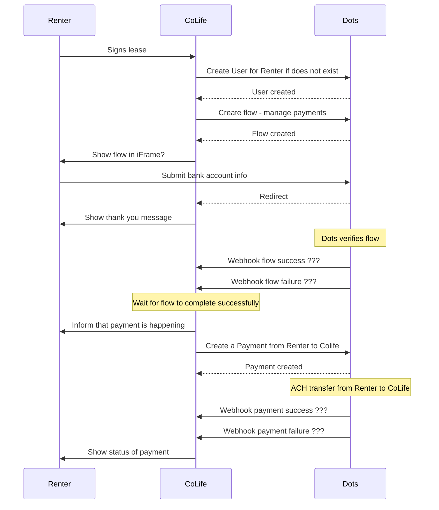

# Scenario 1: Renter signs lease and makes initial rent payment

```mermaid
  sequenceDiagram
      Renter->>CoLife: Signs lease
      CoLife->>Dots: Create User for Renter if does not exist
      Dots-->>CoLife: User created
      CoLife->>Dots: Create flow - manage payments
      Dots-->>CoLife: Flow created
      CoLife->>Renter: Show flow in iFrame?
      Renter->>Dots: Submit bank account info
      Dots-->>CoLife: Redirect
      CoLife->>Renter: Show thank you message
      Note over Dots: Dots verifies flow
      Dots->>CoLife: Webhook flow success ???
      Dots->>CoLife: Webhook flow failure ???
      Note over CoLife: Wait for flow to complete successfully
      CoLife->>Renter: Inform that payment is happening
      CoLife->>Dots: Create a Payment from Renter to Colife
      Dots-->>CoLife: Payment created
      Note over Dots: ACH transfer from Renter to CoLife
      Dots->>CoLife: Webhook payment success ???
      Dots->>CoLife: Webhook payment failure ???
      CoLife->> Renter: Show status of payment
```

### Questions:
 - What webhooks are sent to CoLife?
 - What else can go wrong?
