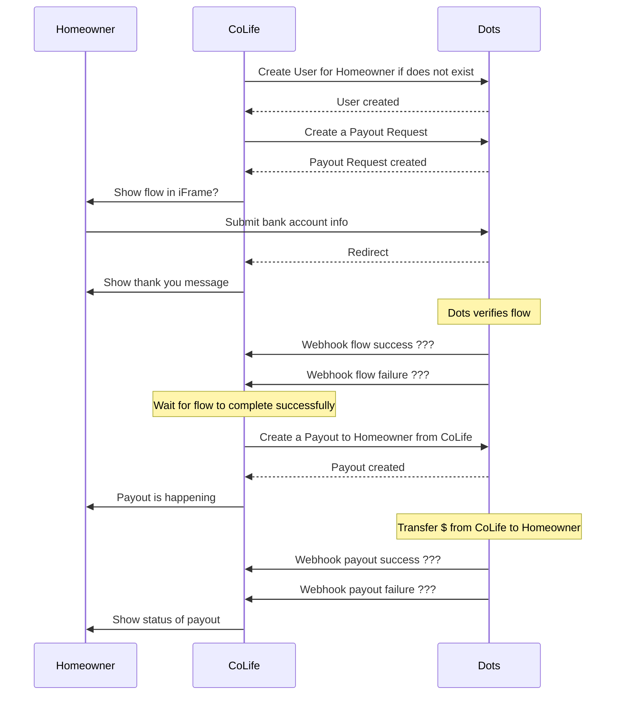

## Scenario 2: CoLife pays homeowner initial rent payout

```mermaid
  sequenceDiagram
      participant Homeowner
      CoLife->>Dots: Create User for Homeowner if does not exist
      Dots-->>CoLife: User created
      CoLife->>Dots: Create a Payout Request
      Dots-->>CoLife: Payout Request created
      CoLife->>Homeowner: Show flow in iFrame?
      Homeowner->>Dots: Submit bank account info
      Dots-->>CoLife: Redirect
      CoLife->>Homeowner: Show thank you message
      Note over Dots: Dots verifies flow
      Dots->>CoLife: Webhook flow success ???
      Dots->>CoLife: Webhook flow failure ???
      Note over CoLife: Wait for flow to complete successfully
      CoLife->>Dots: Create a Payout to Homeowner from CoLife
      Dots-->>CoLife: Payout created
      CoLife->>Homeowner: Payout is happening
      Note over Dots: Transfer $ from CoLife to Homeowner
      Dots->>CoLife: Webhook payout success ???
      Dots->>CoLife: Webhook payout failure ???
      CoLife->>Homeowner: Show status of payout
```

### Questions:
  - What are the webooks that Dots sends?
  - What can go wrong?
