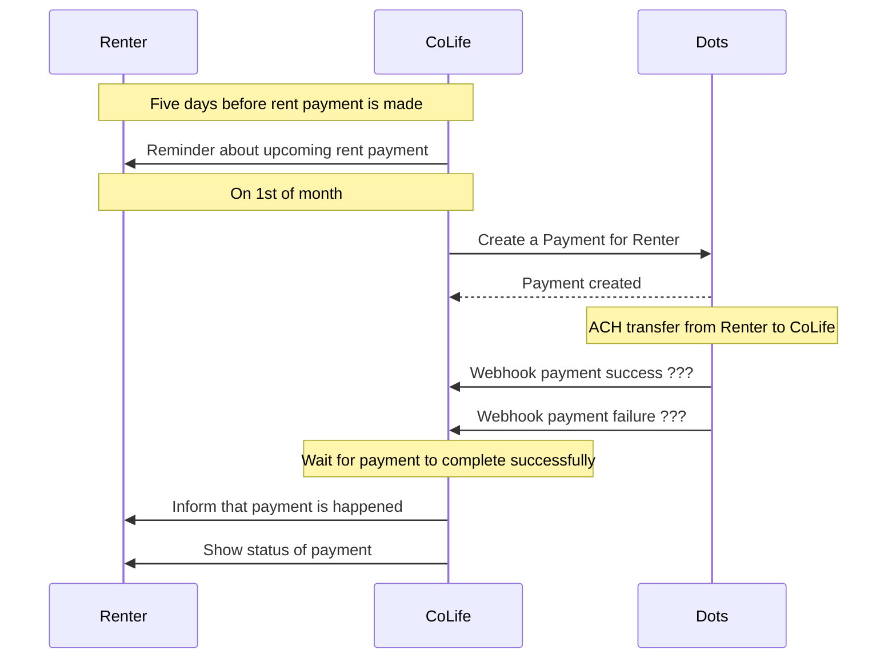

# Scenario 3: CoLife charges Renter subsequent month's rent

```mermaid
  sequenceDiagram
      participant Renter
      participant CoLife
      Note over Renter,CoLife: Five days before rent payment is made
      CoLife->>Renter: Reminder about upcoming rent payment
      Note over Renter,CoLife: On 1st of month
      CoLife->>Dots: Create a Payment for Renter
      Dots-->>CoLife: Payment created
      Note over Dots: ACH transfer from Renter to CoLife
      Dots->>CoLife: Webhook payment success ???
      Dots->>CoLife: Webhook payment failure ???
      Note over CoLife: Wait for payment to complete successfully
      CoLife->>Renter: Inform that payment is happened
      CoLife->> Renter: Show status of payment
```

### Questions:
 - What happens if payment fails?
 - What else can go wrong?
