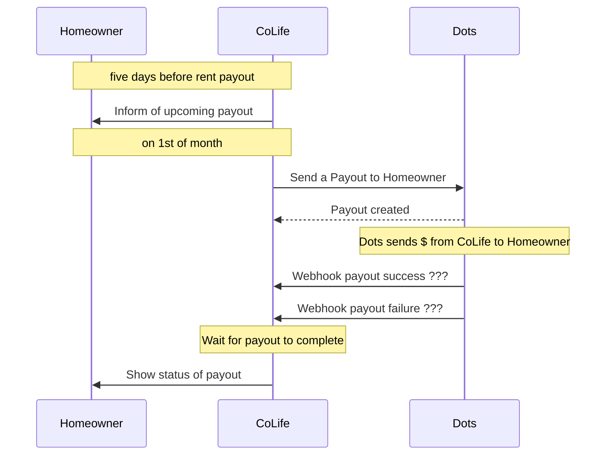

## Scenario 4: CoLife pays Homeowner subsequent rent payout

```mermaid
  sequenceDiagram
      participant Homeowner
      participant CoLife
      Note over Homeowner,CoLife: five days before rent payout
      CoLife->>Homeowner: Inform of upcoming payout
      Note over Homeowner,CoLife: on 1st of month
      CoLife->>Dots: Send a Payout to Homeowner
      Dots-->>CoLife: Payout created
      Note over Dots: Dots sends $ from CoLife to Homeowner
      Dots->>CoLife: Webhook payout success ???
      Dots->>CoLife: Webhook payout failure ???
      Note over CoLife: Wait for payout to complete
      CoLife->>Homeowner: Show status of payout
```

### Questions:
  - What are the webooks that Dots sends?
  - What can go wrong?
