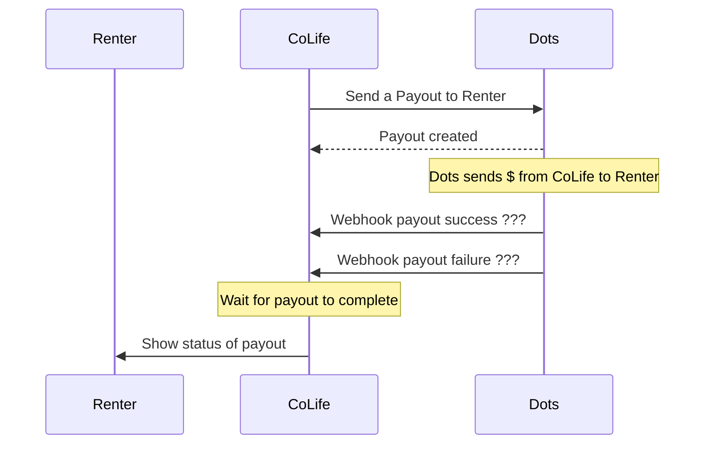

# Scenario 5: CoLife refunds money to Renter

```mermaid
  sequenceDiagram
      participant Renter
      participant CoLife
      CoLife->>Dots: Send a Payout to Renter
      Dots-->>CoLife: Payout created
      Note over Dots: Dots sends $ from CoLife to Renter
      Dots->>CoLife: Webhook payout success ???
      Dots->>CoLife: Webhook payout failure ???
      Note over CoLife: Wait for payout to complete
      CoLife->>Renter: Show status of payout
```

### Questions:
  - What are the webooks that Dots sends?
  - What can go wrong?
