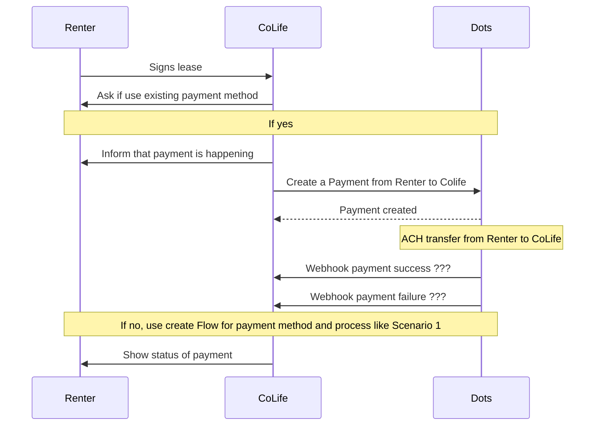

# Scenario 6: Renter signs lease with a new homeowner

```mermaid
  sequenceDiagram
      Renter->>CoLife: Signs lease
      CoLife->>Renter: Ask if use existing payment method
      Note over Renter,Dots: If yes
      CoLife->>Renter: Inform that payment is happening
      CoLife->>Dots: Create a Payment from Renter to Colife
      Dots-->>CoLife: Payment created
      Note over Dots: ACH transfer from Renter to CoLife
      Dots->>CoLife: Webhook payment success ???
      Dots->>CoLife: Webhook payment failure ???
      Note over Renter,Dots: If no, use create Flow for payment method and process like Scenario 1
      CoLife->> Renter: Show status of payment
```

### Questions:
 - What webhooks are sent to CoLife?
 - What else can go wrong?
